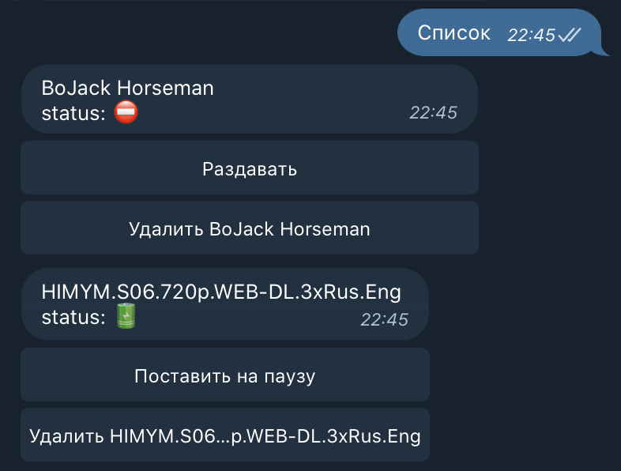
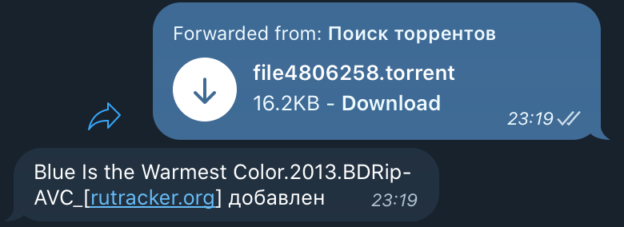

# Transmission-telegram-private-bot

Телеграм бот, для личного использования.  
Если ему отправить torrent file или magnet ссылку, то через rpc подает запросы на transmission сервер.  
Также можно управлять процессом раздачи каждого трекера  

При изменении статуса раздачи уведомляет

Рекомендую использовать вместие с [докер контейнером transmission](https://hub.docker.com/r/linuxserver/transmission)

### Список задач:
​
### Изменение статуса:

### Добавление файла:


**По сути это упрощенный клиент transmission для **телеграмма****

## Сборка
```bash
git clone https://github.com/meshchaninov/transmission-telegram-private-bot.git
cd transmission-telegram-private-bot-master
docker build -t transmission-bot . \
--build-arg TOKEN=<token> \
--build-arg ACCESS=<access> \
--build-arg TRANSMISSION_URL=<transmission_url> \
--build-arg TRANSMISSION_LOGIN=<login> \
--build-arg TRANSMISSION_PASSWORD=<password> \
--build-arg TRANSMISSION_PORT=<transmission_port> \
--build-arg TIME_SHEDULE_SEC=<time_shedule_sec> \
--build-arg SOCKS5_LOGIN=<socks5_login> \
--build-arg SOCKS5_PASSWORD=<socks5_password> \
--build-arg SOCKS5_ADDRESS=<socks5_address>
```

Каждое из значений:
-   TOKEN – токен из botFather телеграмма
-   ACCESS - id пользователей у которых есть доступ к телеграмму (Их может быть несколько Пример: ```ACCESS=1111:2222:3333```)
-   TRANSMISSION_URL – адресс где хостится transmission
-   TRANSMISSION_LOGIN – логин в клиенте transmission (надеюсь у вас он есть, как и пароль. В опасное время живем:))
-   TRANSMISSION_PASSWORD - пароль в клиенте transmission
-   TRANSMISSION_PORT - порт клиента transmission. Обычно 9091
-   TIME_SHEDULE_SEC – период через которое бот будет проаерять изменение статуса у трекера в секундах (Пример: ```TIME_SHEDULE_SEC=300```, уведомлять о изменениях, если они есть, раз в 5 минут)
-   SOCKS5_LOGIN - логин socks5 сервера (Если ты из России, то по другому бот и не запустить, обязталеьно нужен прокси)
-   SOCKS5_PASSWORD - пароль socks5 сервера
-   SOCKS5_ADDRESS - адресс socks5 сервера

**Опять же повторю, делалось для личного использования. Из-за этого реализация топорна и отсутствует гипкость.**
